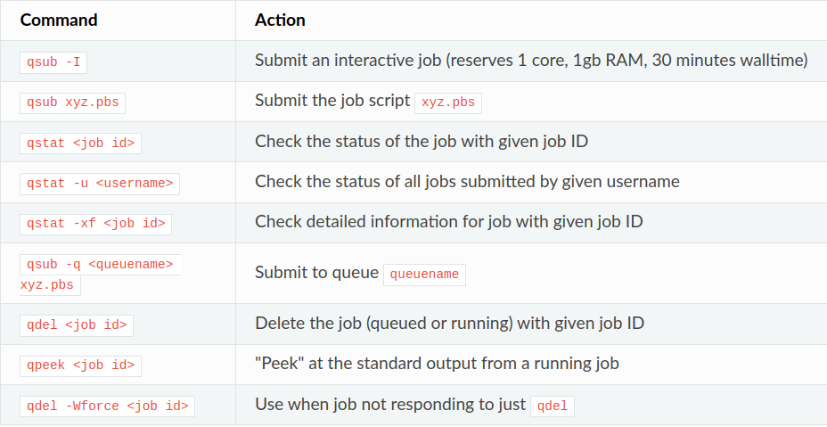

# Setup Instructions on the [Palmetto Cluster](https://www.palmetto.clemson.edu/palmetto/)

### 0. Log in

Login to Palmetto via ssh.

### 1. Install Conda

On the login node, follow instructions on the [ user documentation](https://www.palmetto.clemson.edu/palmetto/software/software/) (step 1 therein) to get the Conda module.

Then, create a Conda environment (call it `salient`):

```bash
conda create -n salient python=3.9 -y
conda activate salient
```

### 2. Check Conda Channels

Check that Conda has the following channels:

```bash
$ conda config --show channels
channels:
  - https://opence.mit.edu
  - https://public.dhe.ibm.com/ibmdl/export/pub/software/server/ibm-ai/conda/
  - defaults
  - conda-forge
```

If some channels are missing:

```bash
conda config --prepend channels [missing_channel]
```

### 3. Install PyTorch & CUDA

```bash
conda install pytorch==1.10.0 torchvision==0.11.0 torchaudio==0.10.0 cudatoolkit==11.3 -c pytorch -c conda-forge
```

### 4. Log in an Interactive Compute Node

Note: Only certain gpus will be able to run salient. We used the a100 in our
experiments

```bash
qsub -l select=1:ncpus=1:mem=1gb:ngpus=1:gpu_model=a100,walltime=8:00:00
```

After getting on the node, activate the Conda environment again:

```bash
conda activate salient
```

The subsequent steps are done on the compute node.

### 5. Install PyTorch-Geometric (PyG)

#### 5.1 Load CUDA Module

List the available CUDA modules and choose one.
We used 'cuda/11.6.2-gcc/9.5.0'

```bash
module avail
```

#### 5.2 Install PyG Dependencies

```bash
export FORCE_CUDA=1
pip install git+git://github.com/rusty1s/pytorch_scatter.git@2.0.7
pip install git+git://github.com/rusty1s/pytorch_cluster.git@1.5.9
pip install git+git://github.com/rusty1s/pytorch_spline_conv.git@1.2.1
pip install git+git://github.com/rusty1s/pytorch_sparse.git@master
```

Note: We install from source here (there are no pre-built wheels for PowerPC).

#### 5.3 Install PyG

```bash
pip install torch-geometric
```

### 6. Install OGB

```bash
pip install ogb
```

### 7. Install SALIENT's fast_sampler

Go to the folder `fast_sampler` and install:

```bash
cd fast_sampler
python setup.py install
cd ..
```

To check that it is properly installed, start python and type:

```python
>>> import torch
>>> import fast_sampler
>>> help(fast_sampler)
```

One should see information of the package.

### 8. Install Other Dependencies

```bash
conda install prettytable -c conda-forge
```

### 9. Try Examples

Congratulations! SALIENT has been installed. The folder `torqueExamples` contains several example scripts to use SALIENT on Palmetto.

To pre-download an OGB dataset before trying the examples, start python and type:

```python
>>> name = # type dataset name here, such as 'ogbn-arxiv'
>>> root = # type dataset root here, such as '/nobackup/users/username/dataset'
>>> from ogb.nodeproppred import PygNodePropPredDataset
>>> dataset = PygNodePropPredDataset(name=name, root=root)
```

Note: When an OGB dataset is used the first time, SALIENT will process it after downloading and will store the processed data under a `processed` subfolder of that dataset. Subsequent uses of SALIENT will directly load the processed data.

Tips: To see all command-line arguments of SALIENT, set `PYTHONPATH` to be the root of SALIENT and type

```bash
python -m driver.main --help
```

#### 9.1 Using the launch.py scripts

We have provided a launch.py script that attempt to launch many processes.
Simply navigate to the torqueExamples repo and then python launch.py this will
spawn many different jobs on Palmetto. To view their process you can use qpeek
to check their status you can use qstatus. 



